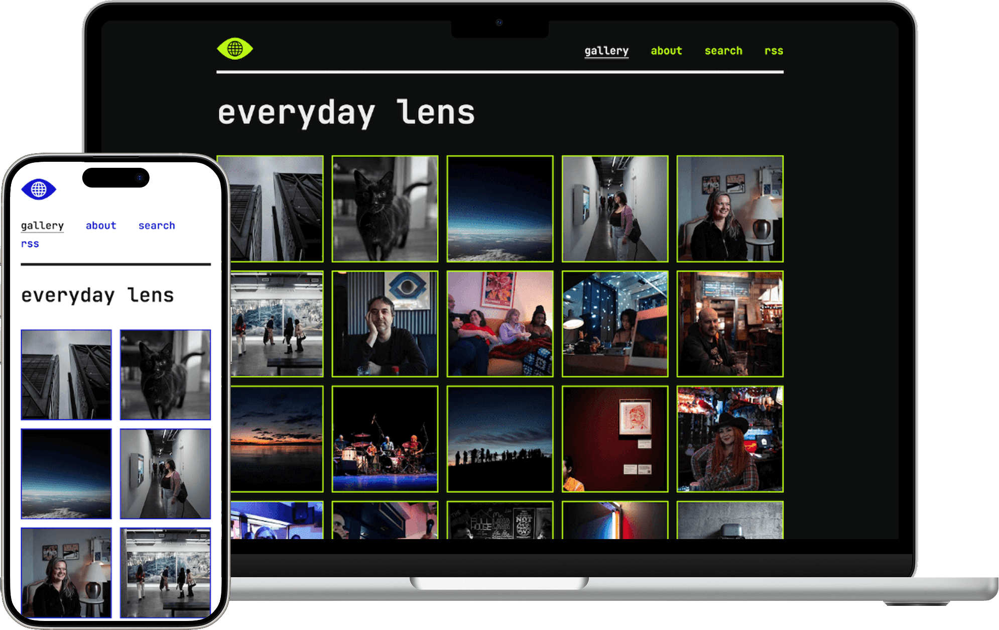
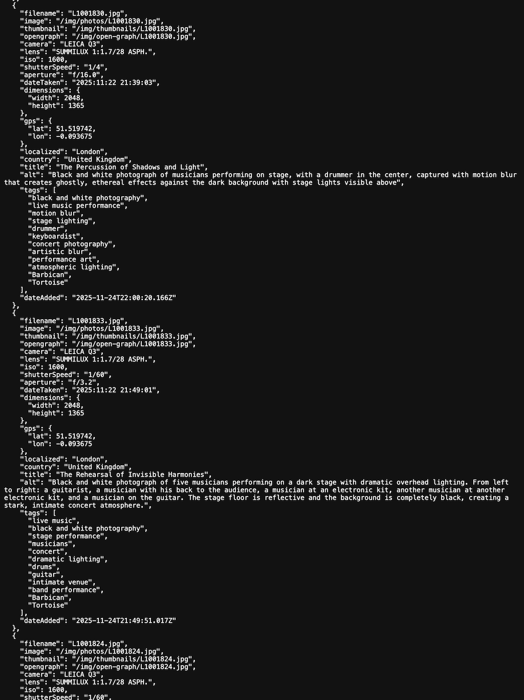
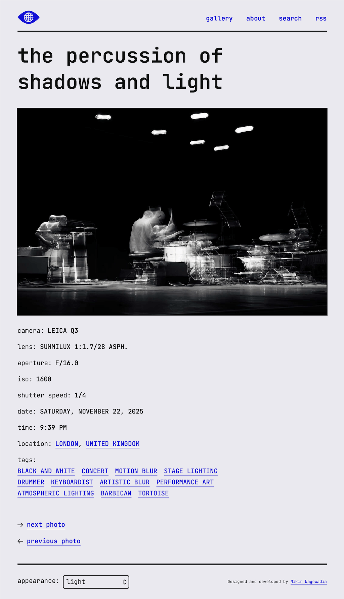
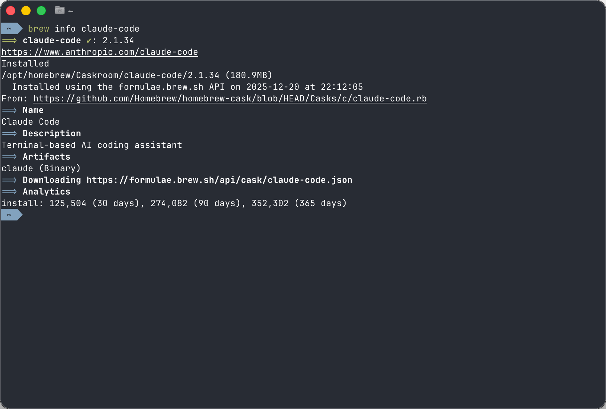

  
As AI tools become part of every designer's workflow, I wanted to understand firsthand where they genuinely add value and where they fall short — not in theory, but through building something real. In the summer of 2025 I built <a href="https://everydaylens.photos">Everyday Lens</a>: a personal publishing system for my photography, designed with AI as a collaborator rather than just a build tool.

  <figure>
    
    <figcaption>Left: Light mode version of Everyday Lens on a mobile device. Right: Dark mode version of Everyday Lens on a laptop.</figcaption>
  </figure>

<section>
  <h2 class="font-size-3">Design judgment</h2>
  
I built this on my own time, with the goal of creating something that would last and that I will use as my primary outlet of sharing my photography for the foreseeable future. Therefore, the system must be easy to upload photos, and the AI must be a valuable collaborator rather than a replacement for my creative decisions.

</section>

<section>
  <h2 class="font-size-3">Design decisions</h2>
  <section>
    <h3 class="font-size-2">Automation first</h3>
    
A script detects new photos, extracts camera metadata, and triggers AI-generated titles, alt text, and tags—reducing publishing time from 10 minutes (manually entering all the metadata) to under 60 seconds. I chose to automate metadata entry specifically because it's the part of publishing that adds no creative value — it's just friction. The actual creative decisions (curation, sequencing, editing) stay with me.

  </section>
  
  <section>
    <h3 class="font-size-2">AI with guardrails</h3>
    
Although Claude does a great job in coming up with a unique title, alt text and tags I made the deliberate choice to review its output. In practice, Claude gets titles, tags and alt text right about 90% of the time. The other 10% is where it defaults to generic or overly literal descriptions — exactly the kind of output that would flatten the work if left unchecked. The review step catches that.

    <figure>
      

        

          <small class="figure-label">Figure 1</small>
          
        

        

          <small class="figure-label">Figure 2</small>
          
        

      

      <figcaption>Figure 1: AI-generated metadata — title, alt text, and tags — along with the camera extracted metadata stored as JSON. Figure 2: The published result, built from those data points.</figcaption>
    </figure>
  </section>
  
  <section>
    <h3 class="font-size-2">Multi-channel distribution</h3>
    
Clean URLs, Open Graph previews, and RSS feeds. Anyone can access and subscribe without signing up to a social media platform.

  </section>
  
  <section>
    <h3 class="font-size-2">Utilitarian design aesthetic</h3>
    
The command-line interface aesthetic wasn't just a style choice. It reflected what the tool actually is: something quiet, utilitarian, running in the background doing its job. No flashy interface: clean typography, high contrast colours. I considered more expressive visual directions early on, but they competed with the photography. The CLI aesthetic solved that — it signals 'tool, not gallery app' and keeps the interface out of the way.

    <figure>
      
      <figcaption>The minimal aesthetic of the CLI influenced the design aesthetic of Everyday Lens.</figcaption>
    </figure>
  </section>

  <section>
    <h3 class="font-size-2">Built with accessibility in mind</h3>
    
Inspired by my work at GDS, from day-one, this site was built with all end-users in mind. Therefore, the colours abide by colour contrast accessibility standards, the font size is legible even for the hard of sight, and it's possible to navigate using only a keyboard.

  </section>
</section>

<section>
  <h2 class="font-size-3">Impact</h2>
  <ul class="list-extra-space ">
    <li><strong>90% AI accuracy baseline</strong> established for creative metadata generation — fast enough to be worthwhile, but a clear reminder that AI output needs human oversight for subjective, creative work</li>
    <li><strong>90+ Lighthouse scores</strong> across performance, accessibility, and SEO</li>
    <li><strong>Influenced how I think about AI as a collaborator</strong>, clearly showing where it can add value and where human judgment is irreplaceable</li>
  </ul>
</section>

<section>
  <h2 class="font-size-3">What's next</h2>
  
Since its launch in August 2025, I've continued to iterate on Everyday Lens — most recently adding search functionality. But the bigger opportunity is in the AI collaboration itself. I'm refining my prompts based on patterns in the outputs I've had to manually correct, particularly around alt text accuracy — ensuring descriptions reflect what's actually in the photo rather than what the model assumes is there. Longer term, there's an interesting question around whether AI could help with curation — suggesting which photos work well together, or flagging when a new upload overlaps too closely with existing work. That's not on the roadmap yet, but it's the kind of direction this system is set up to explore.

</section>