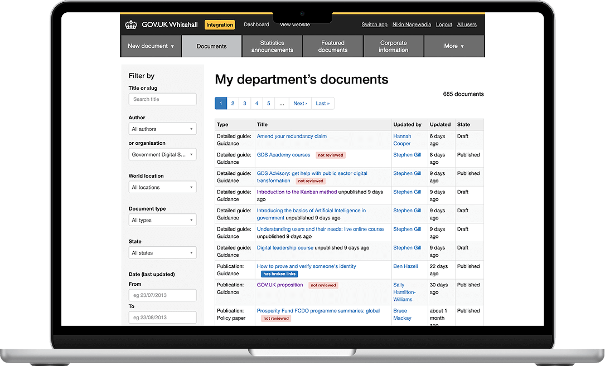
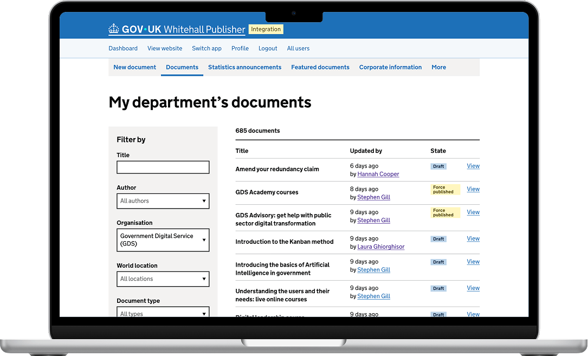

  
At the Government Digital Service (GDS), I designed products and systems used by millions of people across <a href="https://gov.uk">GOV.UK</a>. That's where I learned what design actually means: building products and services people can trust.

  
Three projects that demonstrate my range:

  <ol class="list-extra-space">
    <li><a href="#gov-uk-publishing-design-guide">GOV.UK Publishing Design Guide</a>: I created a design guide for internal publishing tools, adopted across teams within GDS and led to the creation of an org-wide Figma UI Kit</li>
    <li><a href="#upgrading-whitehall-publisher">Upgrading Whitehall Publisher</a>: I modernized a legacy CMS used by content teams across government departments, reducing complexity and establishing reusable patterns</li>
    <li><a href="#covid-19-local-checker-and-travel-checker">COVID-19 Local Checker and Travel Checker</a>: I designed two emergency services for location-specific restrictions under extreme time pressure that influenced future infrastructure investment for GOV.UK</li>
  </ol>

<section>
  <h2 class="font-size-3">GOV.UK Publishing Design Guide</h2>
  

    
While GOV.UK has a mature <a href="https://design-system.service.gov.uk">Design System</a>, guidance for editorial design and publishing tools was fragmented across documents, wikis, and team-owned resources. This fragmentation slowed teams down, caused inconsistency, and made onboarding new designers unnecessarily difficult.

    
I identified the opportunity to consolidate this knowledge into a single source of truth: the <a href="https://design-guide.publishing.service.gov.uk">GOV.UK Publishing Design Guide</a>.

    <figure>
      
      <figcaption>Left: GOV.UK Publishing Design Guide's homepage on a mobile device. Right: Overview page of Frontend Templates on a laptop.</figcaption>
    </figure>
  

  
  <section>
    <h3 class="font-size-2">Design judgment</h3>
    
With just myself, a service designer, a tight fiscal quarter, and a fragmented mess of docs to consolidate, I prioritized adoption over completeness — solving a real frustration: designers spending hours hunting for guidance that should have been easy to find.

  </section>
  
  <section>
    <h3 class="font-size-2">Design decisions</h3>
    <ul class="list-extra-space">
      <li><strong>Lean validation first:</strong> Started with a shared Google Doc to consolidate existing knowledge, align contributors, and validate structure before committing to a technical solution</li>
      <li><strong>Design through delivery:</strong> With a single fiscal quarter to ship, I skipped high-fidelity Figma mocks and built directly in 11ty. Every day spent designing in Figma was a day we couldn't spend validating with real users—so I built first and iterated fast.</li>
      <li><strong>Planned for extensibility:</strong> Scoped the initial release tightly while laying foundations for future component references, Figma embeds, and code snippets</li>
      <li><strong>Intentional visual clarity:</strong> Introduced a small set of Lego-inspired illustrations to support conceptual clarity and differentiate the guide without compromising GOV.UK's utilitarian design principles. The illustrations demonstrate the difference between components, patterns, and frontend templates through visual storytelling.</li>
    </ul>
  </section>

  <section>
    <h3 class="font-size-2">Impact</h3>
    <ul class="list-extra-space">
      <li>Adopted across GDS by designers, developers, researchers, product managers, and content designers</li>
      <li>Reduced onboarding time and eliminated duplicated documentation work across teams</li>
      <li>Inspired similar platforms created by other government teams</li>
      <li>Directly influenced the creation of an organization-wide Figma UI Kit used across government</li>
    </ul>
  </section>
</section>

<section>
  <h2 class="font-size-3">Upgrading Whitehall Publisher</h2>
  

    
Whitehall Publisher is the UK government's internal CMS, used across departments to publish guidance, news, and policy content to GOV.UK. The legacy system relied on outdated components and inconsistent workflows, increasing cognitive load, slowing delivery, and introducing avoidable errors.

    
I led the user-experience and interface design effort to upgrade Whitehall Publisher to the GOV.UK Design System while content designers continue to publish on GOV.UK.

  

  
  <section>
    <h3 class="font-size-2">Design judgment</h3>
    
I balanced modernization with operational stability. Internal tools like this are easy to deprioritize—but 2000+ content designers rely on Whitehall every day to keep GOV.UK running.

    <figure>
      

        

          <small>figure 1:</small>
          
        

        

          <small>figure 2:</small>
          
        

      

      <figcaption>Figure 1: Document search interface before upgrade. Figure 2: Document search interface after upgrade.</figcaption>
    </figure>
  </section>
  
  <section>
    <h3 class="font-size-2">Design decisions</h3>
    <ul class="list-extra-space">
      <li><strong>Replaced legacy components</strong> with GOV.UK Design System equivalents to improve consistency and accessibility</li>
      <li>Took the opportunity to <strong>simplify some publishing flows</strong> based on prior research, usability findings, as well as adopting common publishing patterns found on modern-day CMS</li>
      <li><strong>Shipped incrementally</strong> on a weekly cadence, validating usability with content designers before rollout</li>
    </ul>
  </section>
  
  <section>
    <h3 class="font-size-2">Impact</h3>
    <ul class="list-extra-space">
      <li><strong>Adopted across government</strong> publishing teams in multiple departments</li>
      <li><strong>Reduced publishing errors:</strong> Users reported faster, more confident publishing in post-launch interviews</li>
      <li><strong>Established baseline patterns</strong> that other GDS publishing tools later adopted, and continue to evolve</li>
    </ul>
  </section>
</section>

<section>
  <h2 class="font-size-3">COVID-19 Local Checker and Travel Checker</h2>
  

    
In late 2020, COVID-19 restrictions changed frequently and varied by location. Guidance was often difficult to interpret, creating confusion at a time when clarity directly affected public trust and compliance.

    
I joined the GDS emergency response team as the sole product designer, responsible for designing two services: <strong>Local Checker</strong> and <strong>Travel Checker</strong>. Both services were designed to deliver location-specific guidance under extreme time constraints and evolving policy requirements.

  

  <section>
    <h3 class="font-size-2">Design judgment</h3>
    
I optimized for speed and clarity in order to support confident decision-making for users during this stressful moment.

  </section>

  <section>
    <h3 class="font-size-2">Design decisions</h3>
    <ul class="list-extra-space">
      <li><strong>Consistency between the two checkers</strong> via similar flows of entering postcode(s) to eliminate ambiguity and avoid complex regional mapping</li>
      <li><strong>Clear output</strong> highlighting to users relevant information, then allowing them to learn more via available guidance</li>
      <li><strong>High-fidelity prototyping</strong> in code using the <a href="https://prototype-kit.service.gov.uk/docs/">GOV.UK Prototype Kit</a> to validate user-flow, accessibility, content design, and edge cases during user testing sessions</li>
    </ul>
  </section>

  <section>
    <h3 class="font-size-2">Prototypes</h3>
    <figure class="figure-between-content figure-prototype">
      <h4 class="font-size-1">Local Checker</h4>
      

        

          <small>figure 3</small>
          
        

        

          <small>figure 4</small>
          
        

      

      <figcaption>Figure 3: Start page for Local Checker. Figure 4: Results page for Local Checker.</figcaption>
    </figure>
    <figure>
      <h4 class="font-size-1">Travel Checker</h4>
      

        

          <small>figure 5</small>
          
        

        

          <small>figure 6</small>
          
        

      

      <figcaption>Figure 5: Start page for Travel Checker. Figure 6: Results page for Travel Checker.</figcaption>
    </figure>
  </section>

  <section>
    <h3 class="font-size-2">Impact</h3>
    <ul class="list-extra-space">
      <li><strong>100% task success in testing:</strong> Participants consistently understood their local restrictions and the restrictions of where they would be travelling to</li>
      <li><strong>Demonstrated how design can help end-users especially during a high stress watershed moment</strong></li>
      <li>The prototype influenced senior leadership's decision to invest in upgrading internal tools. The service itself didn't ship due to CMS limitations, but <strong>the work shifted how the organization thought about content as structured data</strong>.</li>
    </ul>
  </section>
</section>