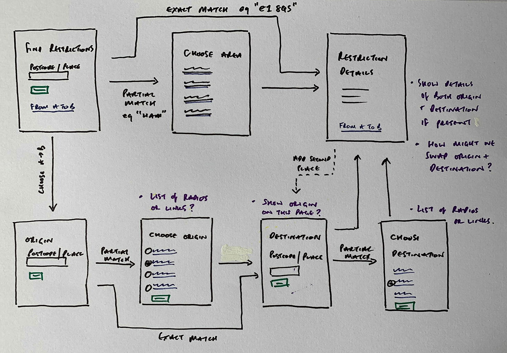

  
In late 2020, COVID-19 restrictions changed frequently and varied by location. Guidance was often difficult to interpret, creating confusion at a time when clarity directly affected public trust and compliance.

  
I joined the GDS emergency response team as the sole product designer, responsible for designing two services: <strong>Local Checker</strong> and <strong>Travel Checker</strong>. Both services were designed to deliver location-specific guidance (via postcode) under extreme time constraints and evolving policy requirements.

<section>
  <h2 class="font-size-3">Design judgment</h2>
  
I optimized for speed and clarity in order to help end-users understand the latest COVID restrictions so they could make informed decisions during this watershed moment.

</section>

<section>
  <h2 class="font-size-3">Design decisions</h2>
  <ul class="list-extra-space">
    <li><strong>Consistency between the two checkers</strong> via similar flows of entering postcode(s) to eliminate ambiguity and avoid complex regional mapping</li>
    <li><strong>Clear output</strong> highlighting to users relevant information, then allowing them to learn more via available guidance</li>
    <li><strong>High-fidelity prototyping</strong> in code using the <a href="https://prototype-kit.service.gov.uk/docs/">GOV.UK Prototype Kit</a> to validate user-flow, accessibility, content design, and edge cases during user testing sessions</li>
  </ul>
</section>

<section>
  <h2 class="font-size-3">Design artefacts</h2>
  <section>
    <h3 class="font-size-1">Early user flow exploration</h3>
    <figure>
      
      <figcaption>Early sketch of a user flow using the postcode checker</figcaption>
    </figure>
  </section>
  <section>
    <h3 class="font-size-1">High-fidelity prototype: Local Checker</h3>
    <figure>
      

        

          <small class="figure-label">Figure 1</small>
          
        

        

          <small class="figure-label">Figure 2</small>
          
        

      

      <figcaption>Figure 1: Start page for Local Checker. Figure 2: Results page for Local Checker.</figcaption>
    </figure>
  </section>
  <section>
    <figure>
      <h3 class="font-size-1">High-fidelity prototype: Travel Checker</h3>
      

        

          <small class="figure-label">Figure 3</small>
          
        

        

          <small class="figure-label">Figure 4</small>
          
        

      

      <figcaption>Figure 3: Start page for Travel Checker. Figure 4: Results page for Travel Checker.</figcaption>
    </figure>
  </section>
</section>

<section>
  <h2 class="font-size-3">Impact</h2>
  <ul class="list-extra-space">
    <li><strong>100% task success in testing:</strong> Participants consistently understood their local restrictions and the restrictions of where they would be travelling to</li>
    <li><strong>Demonstrated how design can help end-users especially during a high stress watershed moment</strong></li>
    <li>The prototype influenced senior leadership's decision to invest in upgrading internal tools. The service itself didn't ship due to CMS limitations, but <strong>the work shifted how the organization thought about content as structured data</strong>.</li>
  </ul>
</section>