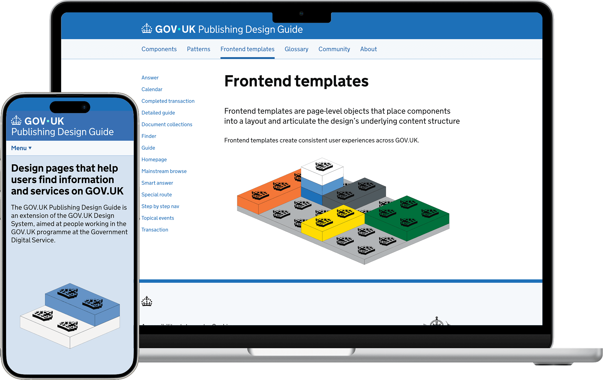
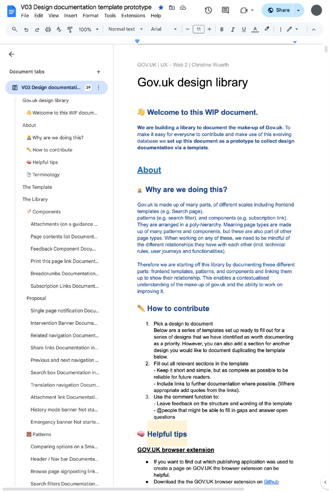
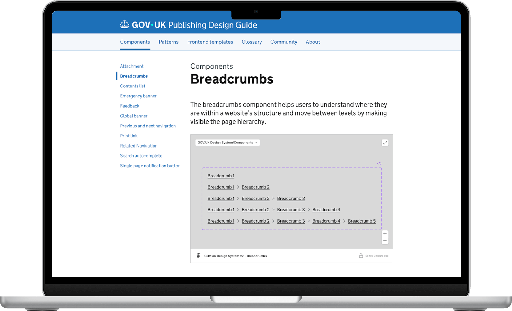
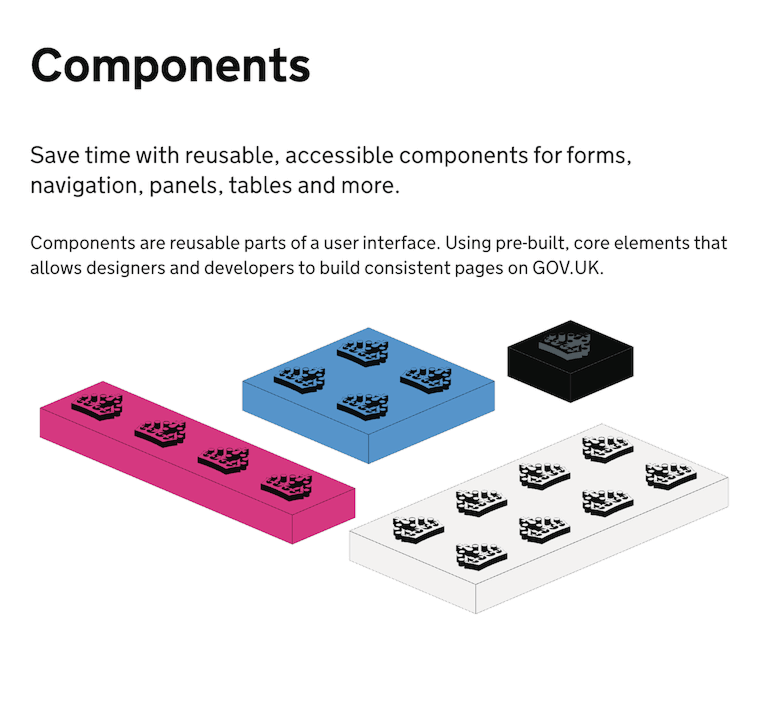
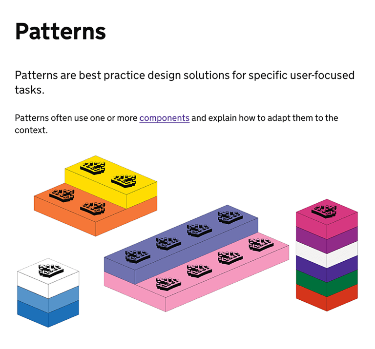
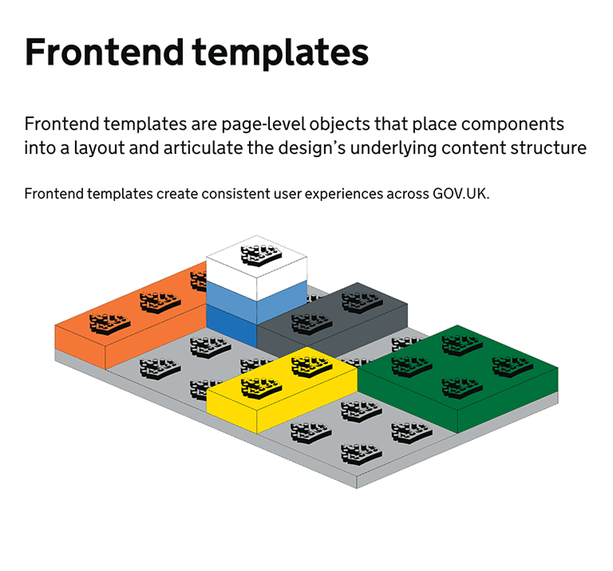
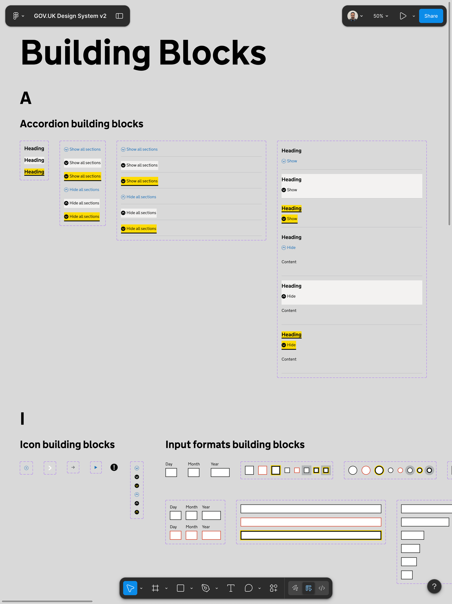
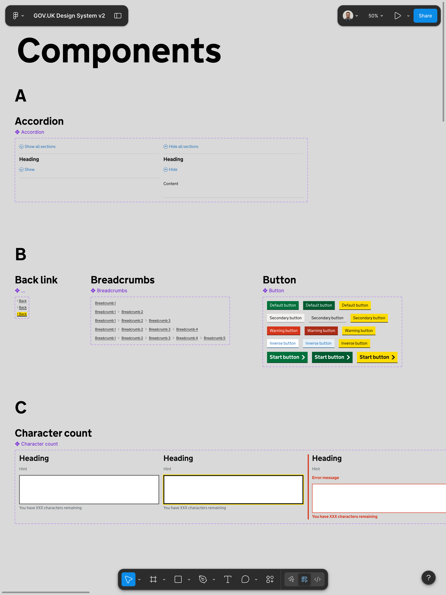

  
While GOV.UK has a mature <a href="https://design-system.service.gov.uk">Design System</a>, guidance for editorial design and publishing tools was fragmented across documents, wikis, and team-owned resources. This fragmentation slowed teams down, caused inconsistency, and made onboarding new designers unnecessarily difficult.

  
I identified the opportunity to consolidate this knowledge into a single source of truth: the <a href="https://design-guide.publishing.service.gov.uk">GOV.UK Publishing Design Guide</a>.

  <figure>
    
    <figcaption>Left: GOV.UK Publishing Design Guide's homepage on a mobile device. Right: Overview page of Frontend Templates on a laptop.</figcaption>
  </figure>

<section>
  <h2 class="font-size-3">Design judgment</h2>
  
With just myself, a service designer, a tight fiscal quarter, and a fragmented mess of docs to consolidate, I prioritized adoption over completeness, solving a real frustration: designers spending hours hunting for guidance that should have been easy to find.

</section>

<section>
  <h2 class="font-size-3">Design decisions</h2>
  <section>
    <h3 class="font-size-2">Lean validation</h3>
    
Started with a shared Google Doc to consolidate existing knowledge, align contributors, and validate structure before committing to a technical solution.

    <figure>
      
      <figcaption>Early prototype of Publishing Design Guide was created in Google Docs.</figcaption>
    </figure>
  </section>
  <section>
    <h3 class="font-size-2">Design through delivery</h3>
    
With a single fiscal quarter to ship, I skipped high-fidelity Figma mocks and built directly in 11ty. Every day spent designing in Figma was a day we couldn't spend validating with real users, so I built first and iterated fast.

  </section>
  <section>
    <h3 class="font-size-2">Planned for extensibility</h3>
    
Scoped the initial release tightly while laying foundations for future component references, Figma embeds, and code snippets.

    <figure>
      
      <figcaption>A component page in the Publishing Design Guide that supports Figma embeds and code snippets as the system evolves.</figcaption>
    </figure>
  </section>
  <section>
    <h3 class="font-size-2">Intentional visual clarity</h3>
    
Introduced a small set of Lego-inspired illustrations to support conceptual clarity and differentiate the guide without compromising GOV.UK's utilitarian design principles. The illustrations demonstrate the difference between components, patterns, and frontend templates through visual storytelling.

    <figure>
      

        

          <small class="figure-label">Figure 1</small>
          
        

        

          <small class="figure-label">Figure 2</small>
          
        

        

          <small class="figure-label">Figure 3</small>
          
        

      

      <figcaption>Examples of the Lego-inspired illustrations to explain to users the difference between Components (Figure 1), Patterns (Figure 2), and Frontend Templates (Figure 3).</figcaption>
    </figure>
  </section>
</section>

<section>
  <h2 class="font-size-3">Impact</h2>
  <ul class="list-extra-space">
    <li>Adopted across GDS by designers, developers, researchers, product managers, and content designers</li>
    <li>Reduced onboarding time and eliminated duplicated documentation work across teams</li>
    <li>Inspired similar platforms created by other government teams</li>
    <li>Directly influenced the creation of an updated Figma UI Kit of the GOV.UK Design System, which can be used as a basis to create editorial and publishing tool specific components</li>
  </ul>
  <figure>
    

      

        <small class="figure-label">Figure 4</small>
        
      

      

        <small class="figure-label">Figure 5</small>
        
      

    

    <figcaption>Version 2 of the GOV.UK Design System Figma UI Kit. Screenshots of the Building Blocks page (Figure 4), and the Components page (Figure 5) within the Figma file.</figcaption>
  </figure>
</section>