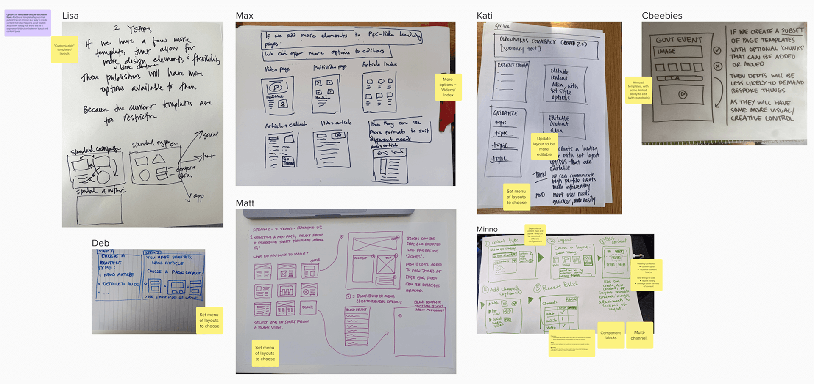
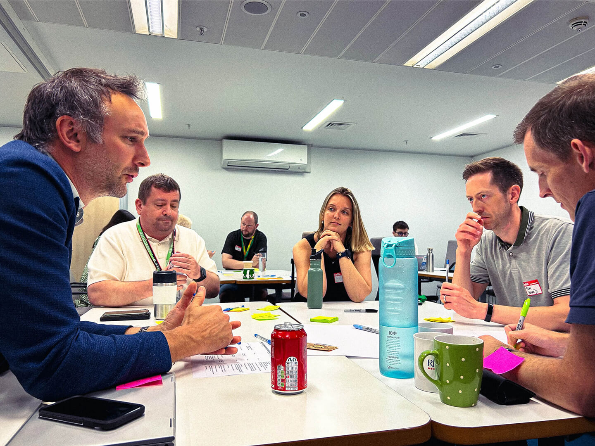
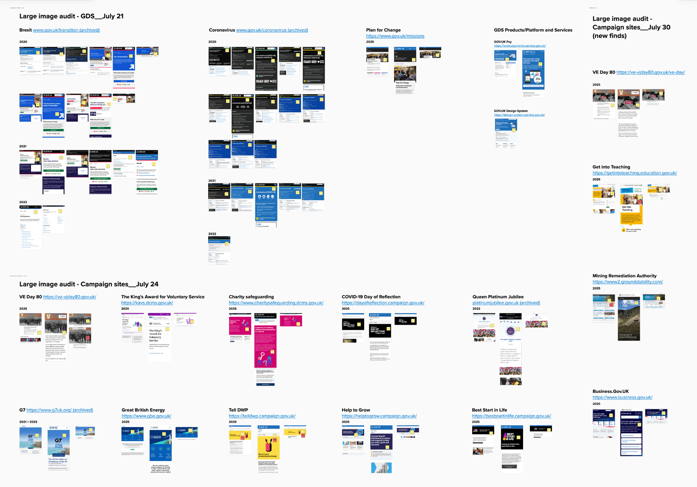
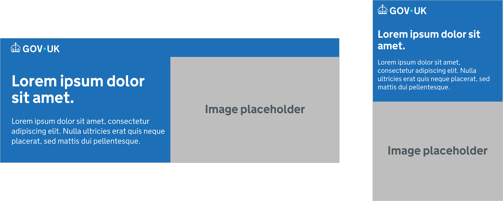
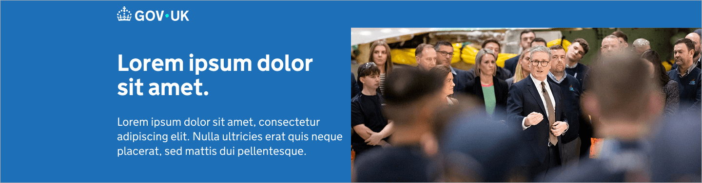
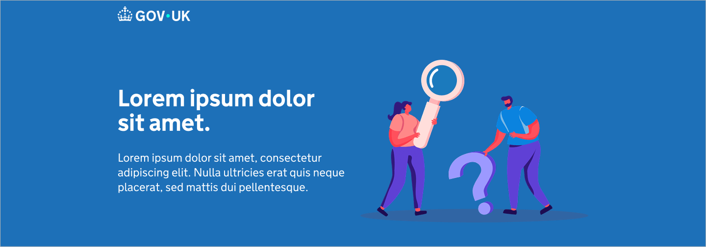
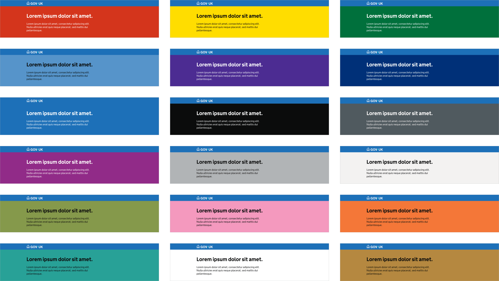
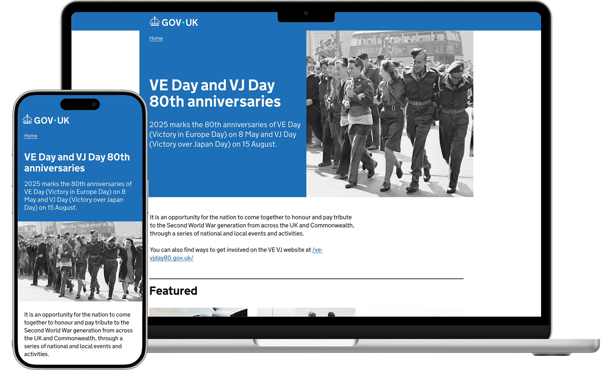
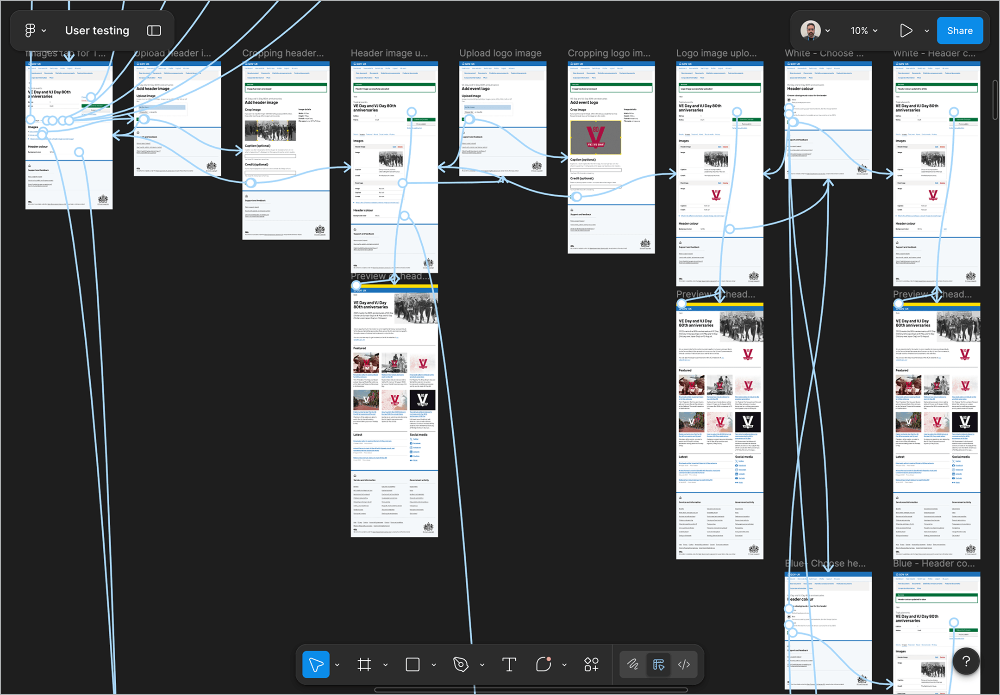

  
GOV.UK has maintained a utilitarian design aesthetic since its inception. Underneath the hood it's powered by Whitehall Publisher, a CMS used by 2,000+ publishers across 400+ government bodies. The system was rigid: departments were hiring external agencies, using taxpayer's money, to develop bespoke sites to achieve visual flexibility. I led the design effort to introduce large imagery as a first step toward a modern GOV.UK.

<section>
  <h2 class="font-size-3">Design judgment</h2>
  
Legibility had to be guaranteed regardless of what image a publisher uploaded, as the outcome has to be accessible to anyone visiting GOV.UK. The solution also had to work at scale: 2,000+ publishers uploading images independently, with little to no developer intervention.

</section>

<section>
  <h2 class="font-size-3">Design decisions</h2>
  <section>
    <h3 class="font-size-2">Running two workshops to find direction</h3>
    
I ran a design charrette with developers, researchers, product managers, and product leads across the GOV.UK frontend and Whitehall Publisher teams, followed by a sketching session with content designers from across government. Both groups, independently, surfaced the same themes: flexible layouts, personalisation, embeddable media, and more visual character, which pointed to large imagery as the first step towards modern and flexible GOV.UK.

    <figure>
      

        

          <small>Figure 1</small>
          
        

        

          <small>Figure 2</small>
          
        

      

      <figcaption>Figure 1: Samples from the design charrette (workshop 1). Figure 2: Participants from the sketching session (workshop 2).</figcaption>
    </figure>
  </section>
  <section>
    <h3 class="font-size-2">Audit before ideation</h3>
    
Before opening Figma, I audited how large imagery had already been handled across GOV.UK. Many visually compelling examples failed on closer inspection. For instance: text over images, page titles rendered as imagery, floating text boxes obscuring the image itself. These failures defined the constraints the design had to solve.

    <figure>
      
      <figcaption>Audit of large imagery across GOV.UK.</figcaption>
    </figure>
  </section>
  <section>
    <h3 class="font-size-2">First principle</h3>
    
It became apparent that text would be in front of a solid colour background, never over an image. On desktop it sits to the left of the image; on mobile, above it, both consistent with GOV.UK's existing reading flow.

    
I explored the inverse layout but rejected it. It created real barriers for users with motor impairments on mobile and those with limited sight on desktop, a finding confirmed by in-house accessibility specialists.

    <figure>
      
      <figcaption>Proposed skeletal designs of component, desktop (left) and mobile (right) variations.</figcaption>
    </figure>
  </section>
  <section>
    <h3 class="font-size-2">Built to handle every real-world scenario</h3>
    
I tested the component with photographs, logos, and no imagery. Each variation had to work so publishers could use it with confidence and without developer intervention.

    <figure>
      

        

          <small>Figure 3</small>
          
        

        

          <small>Figure 4</small>
          
        

        

          <small>Figure 5</small>
          
        

      

      <figcaption>Figure 3: Example with photo. Figure 4: Example with a graphic. Figure 5: Example with no imagery.</figcaption>
    </figure>
  </section>
  <section>
    <h3 class="font-size-2">Header background colour as department identity</h3>
    
While solving for legibility I identified an opportunity: a customisable background colour would let departments express their visual identity without bespoke sites. Every pairing was drawn from the GOV.UK Design System and tested against AA contrast standards.

    <figure>
      
      <figcaption>Birds-eye view of all colours available.</figcaption>
    </figure>
  </section>
  <section>
    <h3 class="font-size-2">Design shaped by developer collaboration</h3>
    
A developer suggested replacing my CSS background image approach with a picture tag, loading the appropriate asset based on the user's viewport and screen density. That led to capping the header at 1024px on desktop and setting a minimum height to prevent awkward cropping on content-light pages.

    
On the backend, the publishing tool, I also separated the upload journey into photograph and logo paths, and updated the cropping tool to preview both desktop and mobile in real time.

    <figure>
      
      <figcaption>Component shown on desktop and mobile, with updated width cap and minimum height applied.</figcaption>
    </figure>
  </section>
  <section>
    <h3 class="font-size-2">User testing</h3>
    
Publishers tested the full flow via Figma prototypes. The standout finding: participants said if this capability had existed, they wouldn't have considered commissioning a bespoke site. Testing also surfaced appetite for a broader colour palette. This revealed a deeper access and permissions challenge now actively being worked on.

    <figure>
      
      <figcaption>Screenshot of Figma file used for user testing.</figcaption>
    </figure>
  </section>
</section>

<section>
  <h2 class="font-size-3">Impact</h2>
  <ul class="list-extra-space">
    <li>Component went live in late March 2026. Publishers can upload imagery without developer intervention</li>
    <li>Applied to live GOV.UK pages: Topical Events, with expansion to other content types underway</li>
    <li>Opened the door to multi-level navigation exploration and further flexibility across the publishing and end-user experience</li>
  </ul>
</section>