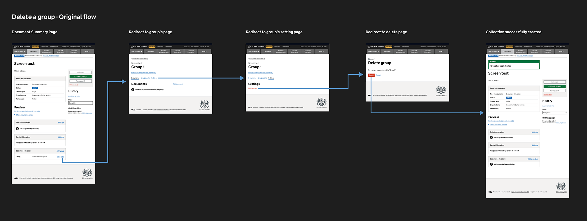
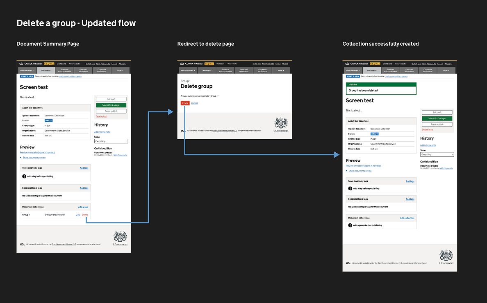

  
Whitehall Publisher is the UK government's internal CMS, used across departments to publish guidance, news, and policy content to GOV.UK. The legacy system relied on outdated components and inconsistent workflows, increasing cognitive load, slowing delivery, and introducing avoidable errors.

  
I led the user-experience and interface design effort to upgrade Whitehall Publisher to the GOV.UK Design System while content designers continue to publish on GOV.UK.

<section>
  <h2 class="font-size-3">Design judgment</h2>
  
I balanced modernization with operational stability. Internal tools like this are easy to deprioritize, but 2000+ content designers rely on Whitehall every day to keep GOV.UK running.

</section>

<section>
  <h2 class="font-size-3">Design decisions</h2>
  <ul class="list-extra-space">
    <li><strong>Replaced legacy components</strong> with GOV.UK Design System equivalents to improve consistency and accessibility</li>
    <li>Took the opportunity to <strong>simplify some publishing flows</strong> based on prior research, usability findings, as well as adopting common publishing patterns found on modern-day CMS</li>
    <li><strong>Shipped incrementally</strong> on a weekly cadence, validating usability with content designers before rollout</li>
  </ul>
  <figure>
    

      

        <small class="figure-label">Figure 1</small>
        
      

      

        <small class="figure-label">Figure 2</small>
        
      

      

        <small class="figure-label">Figure 3</small>
        
      

      

        <small class="figure-label">Figure 4</small>
        
      

      

        <small class="figure-label">Figure 5</small>
        
      

      

        <small class="figure-label">Figure 6</small>
        
      

    

    <figcaption>Figure 1: Document search interface before upgrade. Figure 2: Document search interface after upgrade. Figure 3: Document collections group interface before upgrade. Figure 4: Document collections group interface after upgrade. Figure 5: Original five-step flow for deleting a group. Figure 6: Simplified three-step flow.</figcaption>
  </figure>
</section>

<section>
  <h2 class="font-size-3">Impact</h2>
  <ul class="list-extra-space">
    <li><strong>Adopted across government</strong> publishing teams in multiple departments</li>
    <li><strong>Reduced publishing errors:</strong> Users reported faster, more confident publishing in post-launch interviews</li>
    <li><strong>Established baseline patterns</strong> that other GDS publishing tools later adopted, and continue to evolve</li>
  </ul>
</section>